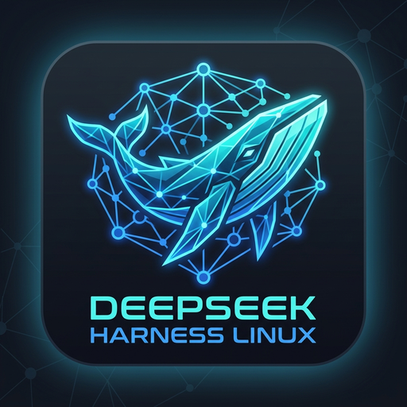

# DeepSeek Harness Linux — Native Linux Desktop Application

<div align="center">



**Native Linux Desktop Wrapper for Official [DeepSeek Harness (`@deepseek-ai/dsh`)](https://github.com/deepseek-ai/deepseek-harness)**

[](https://github.com/MSpider3/Deepseek-Harness-Linux-Desktop-App/actions/workflows/ci.yml)
[](https://github.com/MSpider3/Deepseek-Harness-Linux-Desktop-App/actions/workflows/release.yml)
[](https://github.com/MSpider3/Deepseek-Harness-Linux-Desktop-App)
[](https://tauri.app)
[](https://www.rust-lang.org)
[](https://nodejs.org)
[](LICENSE)

[**Download v0.1.0**](https://github.com/MSpider3/Deepseek-Harness-Linux-Desktop-App/releases/tag/v0.1.0) • [**Architecture**](docs/architecture.md) • [**Contributing**](#-contributing) • [**Documentation**](#-documentation-index)

</div>

> [!WARNING]
> **Active Development Status**: This project is under active development. Features, runtime workflows, and UI components are continuously evolving, so things may change or occasionally break. Always verify changes in the built-in Sandbox and use Snapshots before applying modifications to mission-critical codebases. Issues and pull requests are warmly welcomed!

---

## 🌟 Overview & Architecture

**DeepSeek Harness Linux** is a high-performance native Linux desktop application built with **Tauri 2, Rust, TypeScript, and React 18**. 

Instead of forking or reimplementing DeepSeek Harness, it serves as a **production-grade desktop shell wrapping the official `@deepseek-ai/dsh` upstream distribution**. This architecture ensures that upstream DeepSeek Harness can evolve independently while desktop users benefit from native Linux desktop ergonomics, multi-version isolation, encrypted secrets, and safe testing sandboxes.

```
┌─────────────────────────────────────────────────────────────────────────────┐
│                    DeepSeek Harness Linux Desktop Shell                     │
│                                                                             │
│  ┌───────────────────────┐  ┌────────────────────────────────────────────┐  │
│  │   Desktop Sidebar     │  │          Main Active Viewport              │  │
│  │  - DSH Web Workspace  │  │  ┌──────────────────────────────────────┐  │  │
│  │  - Providers & Models │  │  │ Official DSH Web UI (iframe:5180)    │  │  │
│  │  - Runtime & Updates  │  │  │  - Isolated Cordis microkernel       │  │  │
│  │  - Sandbox & Testing  │  │  │  - Dynamic Loopback port binding     │  │  │
│  │  - Snapshots & Git    │  │  │  - Auto-configured cordis.patch.yml  │  │  │
│  │  - Process Logs       │  │  └──────────────────────────────────────┘  │  │
│  │  - Settings & Diag    │  │  Alternative Panels: Providers, Sandbox,    │  │
│  │                       │  │  Updates, Snapshots, Streaming Logs, etc.  │  │
│  └───────────────────────┘  └────────────────────────────────────────────┘  │
│                                      │                                      │
│               IPC / Commands         ▼                                      │
│  ┌───────────────────────────────────────────────────────────────────────┐  │
│  │                          Rust Core Subsystems                         │  │
│  │  ┌───────────────────────┐  ┌───────────────────┐  ┌───────────────┐  │  │
│  │  │ Process Supervisor    │  │ Runtime Manager   │  │ Secret Store  │  │  │
│  │  │ (Sigterm, Healthcheck)│  │ (Versions/Rollback│  │ (Keyring/AES) │  │  │
│  │  └───────────────────────┘  └───────────────────┘  └───────────────┘  │  │
│  │  ┌───────────────────────┐  ┌───────────────────┐  ┌───────────────┐  │  │
│  │  │ Sandbox Staging & Diff│  │ Provider Syncer   │  │ SQLite DB     │  │  │
│  │  │ (Test Runner, Applier)│  │ (Cordis YAML gen) │  │ (Migrations)  │  │  │
│  │  └───────────────────────┘  └───────────────────┘  └───────────────┘  │  │
│  └───────────────────────────────────────────────────────────────────────┘  │
└─────────────────────────────────────────────────────────────────────────────┘
```

---

## 📦 Downloads & Releases (`v0.1.0`)

Pre-compiled packages for all major Linux distributions are available on the [**GitHub Releases Page**](https://github.com/MSpider3/Deepseek-Harness-Linux-Desktop-App/releases):

| Package Format | Target Distribution | Installation / Execution Command |
| :--- | :--- | :--- |
| **AppImage** | Universal Linux | `chmod +x DeepSeek-Harness-Linux-0.1.0.AppImage && ./DeepSeek-Harness-Linux-0.1.0.AppImage` |
| **RPM Package** | Fedora / RHEL / openSUSE | `sudo dnf install ./deepseek-harness-linux-0.1.0.x86_64.rpm` |
| **Debian Package** | Ubuntu / Debian / Pop!_OS | `sudo apt install ./deepseek-harness-linux_0.1.0_amd64.deb` |
| **Standalone Tarball** | Any x86_64 Linux | `tar -xzf deepseek-harness-linux-0.1.0-linux-x86_64.tar.gz && ./deepseek-harness-linux/deepseek-harness-linux` |

---

## 🚀 Key Features

### 1. Official Upstream DSH Integration
- Direct execution of `@deepseek-ai/dsh` (`0.1.0-rc.8`+) via isolated Node process.
- Launches official browser profile with `--no-open --port <port> --host 127.0.0.1` and embeds the responsive interface.
- Zero fork drift — 100% compatible with upstream plugins and updates.

### 2. Isolated Multi-Version Runtime Manager & Atomic Updates
- Version directories isolated in `~/.local/share/deepseek-harness-linux/runtime/versions/`.
- Atomic symlinks (`runtime/current` and `runtime/previous`).
- Automatic npm registry update tracking across **Stable** (`latest`), **Release Candidate** (`next`), and **Development** channels.
- Staged smoke testing before activation and **1-click instant rollback**.

### 3. Provider & Model Hub (Linux Secret Service Keyring)
- Presets and full discovery for **DeepSeek (V3 / R1)**, **OpenAI (GPT-4o / o1 / o3-mini)**, **Anthropic (Claude 3.7 Sonnet)**, **Google Gemini**, **OpenRouter**, **Local Ollama**, and custom OpenAI-compatible gateways.
- API keys encrypted directly in the Linux Secret Service (GNOME Keyring / KWallet) with PBKDF2 + AES-256-GCM encrypted disk fallback.
- Dynamically generates `$DSH_HOME/cordis.patch.yml` and passes credentials via child process memory.

### 4. Sandbox & Test-Gated Safe Workspace
- One-click temporary staging workspace creation for safe modification testing.
- Automatic project detection for **Node.js** (`npm test`), **Python** (`pytest`), and **Rust** (`cargo test`).
- Fast test execution with dependency caching.
- Side-by-side **unified diff viewer** with test-gated change approval and atomic application.

### 5. Point-in-Time Snapshots & Git Tracking
- Live Git branch and dirty working directory monitoring.
- Point-in-time compressed tarball project snapshots before major agent refactors.
- One-click snapshot rollback and recovery.

### 6. Privacy & Redacted Process Logs
- Regex-powered redaction engine scrubbing API keys (`sk-...`), Bearer tokens, and passwords in real-time.
- Live streaming log viewer with stream filters (`stdout`, `stderr`, `system`), full-text search, and clean diagnostic bundle exporter.

### 7. Native Linux Desktop Experience
- Freedesktop `.desktop` menu launcher installer.
- Linux System Tray with start/stop/status menu.
- Start-on-boot support.
- Rich dark-mode Vanilla CSS design tokens with smooth glassmorphism and micro-animations.

---

## 🛠️ Quickstart & Development

### Prerequisites
- **Linux Distribution**: Fedora 40+, Ubuntu 22.04+, Debian 12+, Arch Linux
- **Node.js**: >= 20.0.0 (Node 22 recommended)
- **Rust**: >= 1.80.0
- **System Libraries**: `gtk3`, `webkit2gtk-4.1` (or `webkit2gtk-4.0`), `libappindicator3`, `libsecret-1`

### 1. Installation & Development

```bash
# Clone the repository
git clone https://github.com/MSpider3/Deepseek-Harness-Linux-Desktop-App.git
cd Deepseek-Harness-Linux-Desktop-App

# Install frontend dependencies
npm --prefix app/frontend install

# Launch desktop app with live UI hot-reload
npm run tauri:dev

# Run tests
cargo test --manifest-path app/src-tauri/Cargo.toml
```

### 3. Building & Packaging

```bash
# Automated packaging pipeline (builds frontend, tests, binary, and tarball)
chmod +x scripts/build_package.sh
./scripts/build_package.sh
```

The resulting distribution archive will be located at:
`dist/deepseek-harness-linux-0.1.0-linux-x86_64.tar.gz`

---

## 🤝 Contributing

We welcome contributions from the open-source community! Follow these steps to contribute:

### Contribution Workflow
1. **Fork the Repository**: Fork [MSpider3/Deepseek-Harness-Linux-Desktop-App](https://github.com/MSpider3/Deepseek-Harness-Linux-Desktop-App) to your GitHub account.
2. **Create a Feature Branch**:
   ```bash
   git checkout -b feature/amazing-new-feature
   ```
3. **Make Surgical, Tested Changes**:
   - Write clean, idiomatic Rust code in `app/src-tauri/` matching existing architecture.
   - Follow component patterns in `app/frontend/src/`.
   - Never write credentials or plaintext secrets to disk.
4. **Run the Verification Test Suite**:
   ```bash
   # Run Rust tests
   cargo test --manifest-path app/src-tauri/Cargo.toml
   
   # Run frontend build & typecheck
   npm --prefix app/frontend run build
   ```
5. **Commit Your Changes**:
   ```bash
   git commit -m "feat: add support for custom provider streaming"
   ```
6. **Open a Pull Request**: Submit a PR to `main` with a clear description of the feature or fix.

---

## 📚 Documentation Index

- **[Developer & Contributor Quickstart](docs/development.md)**
- **[Developer Architecture & Subsystems Blueprint](docs/developer-guide.md)**
- **[System Architecture & Design Decisions](docs/architecture.md)**
- **[Upstream Capability Matrix & Seam Analysis](docs/upstream-capability-matrix.md)**
- **[Upstream Compatibility & Tracking Policy](docs/upstream-compatibility.md)**
- **[Security Doctrine & Linux Secret Store](docs/security.md)**
- **[Sandbox & Safe Staging Pipeline](docs/sandbox.md)**
- **[Atomic Runtime Updates & Rollback](docs/update-system.md)**
- **[Provider & Model Management](docs/provider-system.md)**
- **[Linux Packaging & Distribution](docs/packaging.md)**

---

## 📄 License
This project is licensed under the MIT License — see the [LICENSE](LICENSE) file for details.
Upstream DeepSeek Harness is developed by DeepSeek AI under its respective upstream license.
